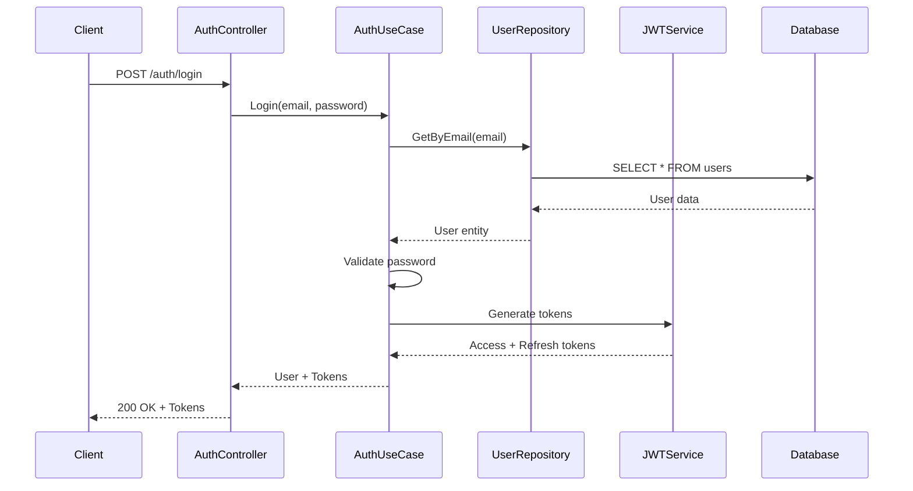
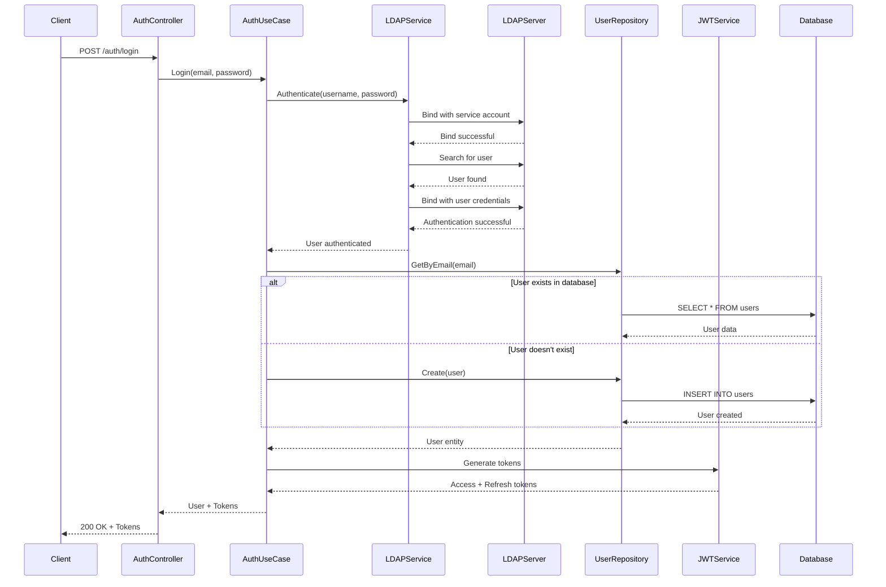
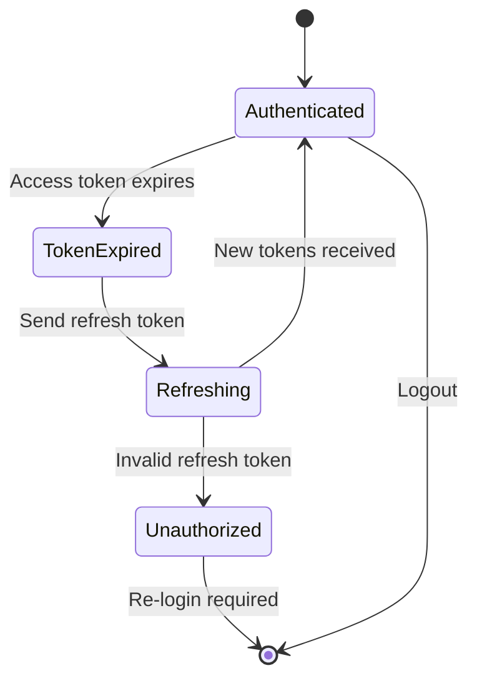

## 🚀 Quick Start

### Prerequisites

- Go 1.24.2+
- Docker & Docker Compose
- MySQL (via Docker)

### Installation

```bash
# Clone the repository
git clone {github_url} go-multi-chat-api
cd go-multi-chat-api

# Copy environment file
cp .env.example .env

# Start services
docker-compose up --build -d
```

### Verify Installation

```bash
# Check if services are running
docker-compose ps

# Test the API
curl http://localhost:8080/v1/health
```

## 🔧 Development

### Project Structure

```
go-multi-chat-api/
├── src/
│   ├── domain/           # 🎯 Domain Layer (Entities & Business Rules)
│   ├── application/      # 📋 Application Layer (Use Cases)
│   └── infrastructure/   # 🔧 Infrastructure Layer
│       ├── di/           # Dependency Injection
│       ├── repository/   # Data Access Layer
│       ├── rest/         # HTTP Controllers
│       ├── security/     # JWT & Security
│       └── logger/       # Structured Logging
├── main.go               # Main Application Entry Point
├── go.mod                # Go Modules
├── go.sum                # Go Dependencies
├── .env                  # Environment Variables
├── .env.example          # Example Environment Variables
├── .gitignore            # Git Ignore File
└── docker-compose.yml    # Development Environment
```

### Available Commands

```bash
# Run the application
go run main.go

# Lint code
golangci-lint run ./...

# Run tests
go test ./...


```

## 🔐 Authentication Flow

### Login Sequence (Local Database)



### LDAP Authentication Sequence



### Token Refresh Flow



## 📊 API Endpoints

### Authentication

- `POST /v1/auth/login` - User login
- `POST /v1/auth/access-token` - Refresh access token

### Users

- `GET /v1/user` - Get all users
- `POST /v1/user` - Create user
- `GET /v1/user/:id` - Get user by ID
- `PUT /v1/user/:id` - Update user
- `DELETE /v1/user/:id` - Delete user
- `GET /v1/user/search` - Search users with pagination
- `GET /v1/user/search-property` - Search by specific property

### Logging Structure

```json
{
  "level": "info",
  "timestamp": "2024-01-01T00:00:00Z",
  "message": "User login successful",
  "user_id": 123,
  "email": "user@example.com",
  "correlation_id": "req-123-456",
  "service": "auth-service"
}
```

### Health Checks

```bash
# Health endpoint
GET /v1/health

# Response
{
  "status": "healthy",
  "timestamp": "2024-01-01T00:00:00Z",
  "version": "1.0.0"
}
```

## 🚀 Deployment

### Docker Deployment

```bash
# Build production image
docker build -t go-multi-chat-apii .

# Run with environment variables
docker run -p 8080:8080 \
  -e DB_HOST=mysql \
  -e DB_PORT=3306 \
  -e JWT_ACCESS_SECRET_KEY=your_secret \
  go-multi-chat-api
```

### Environment Variables

```bash
# Server Configuration
DB_HOST=localhost
DB_PORT=3306
DB_USER=mysql
DB_PASSWORD=mysql
DB_NAME=go-multi-chat-api
DB_SSLMODE=disable
SERVER_PORT=8080

# Database Connection Pool Configuration
DB_MAX_IDLE_CONNS=10
DB_MAX_OPEN_CONNS=50
DB_CONN_MAX_LIFETIME=300

# JWT Configuration
JWT_ACCESS_SECRET_KEY=devAccessSecretKey123456789
JWT_ACCESS_TIME_MINUTE=15
JWT_REFRESH_SECRET_KEY=devRefreshSecretKey123456789
JWT_REFRESH_TIME_HOUR=168
JWT_ISSUER=go-multi-chat-api

# Initial User Configuration
START_USER_EMAIL=anandhans8@gmail.com
START_USER_PW=qwerty123

# LDAP Configuration
LDAP_ENABLED=false                   # Set to true to enable LDAP authentication
LDAP_URL=ldap.example.com:389        # LDAP server URL with port
LDAP_BIND_DN=cn=admin,dc=example,dc=com  # Service account DN for initial bind
LDAP_BIND_PASSWORD=admin_password    # Service account password
LDAP_BASE_DN=dc=example,dc=com       # Base DN for user search
LDAP_USER_FILTER=(uid=%s)            # Filter to search for users, %s will be replaced with username
LDAP_TLS_ENABLED=false               # Set to true to use TLS for LDAP connection
LDAP_ATTRIBUTES=uid,mail,givenName,sn # Comma-separated list of attributes to retrieve

# Azure AD Configuration
AZURE_AD_ENABLED=false               # Set to true to enable Azure AD authentication
AZURE_AD_TENANT_ID=your-tenant-id    # Azure AD Tenant ID
AZURE_AD_CLIENT_ID=your-client-id    # Azure AD Client ID
AZURE_AD_CLIENT_SECRET=your-client-secret # Azure AD Client Secret
AZURE_AD_REDIRECT_URI=http://localhost:8080/auth/callback # Redirect URI after
AZURE_AD_SCOPE=openid,profile,email   # Scopes to request from Azure AD

# Signal CLI Configuration
SIGNAL_CLI_CONFIG_DIR="/path/to/signal-cli/config"
SIGNAL_FROM_NUMBER="+1234567890"

```
